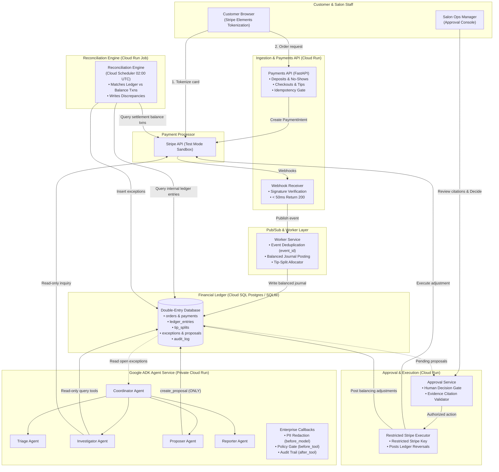
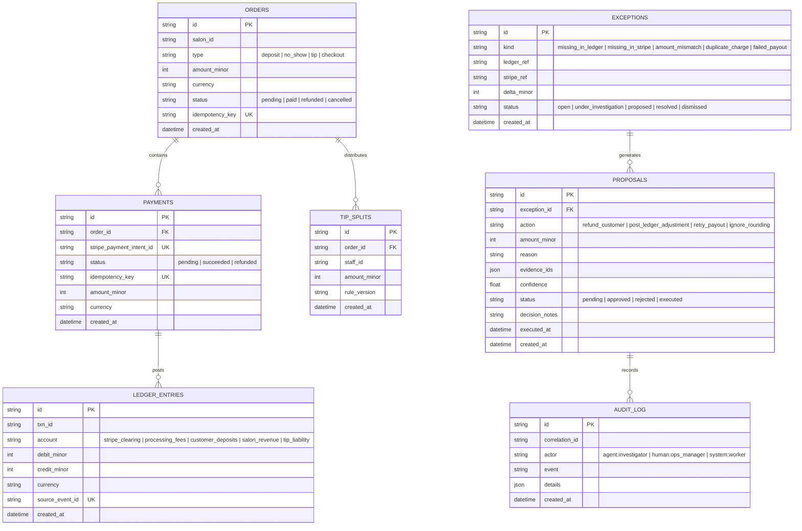
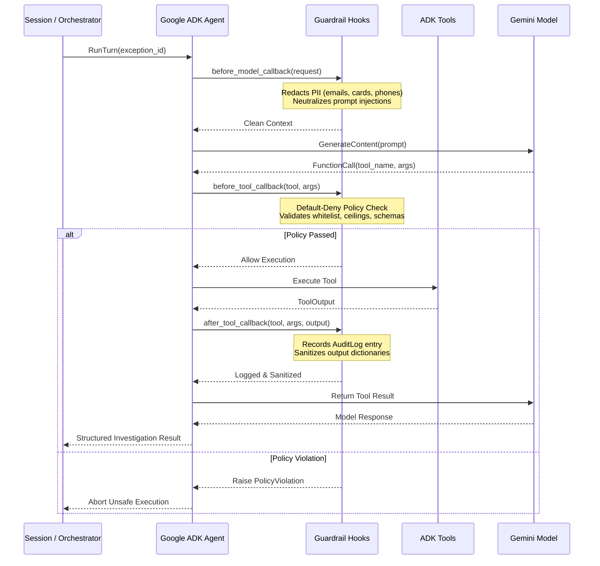

# Salon Payments Ops Agent: Architecture & Runtime (Google ADK on Cloud Run)

[](https://github.com/salon-payments-ops/finance-agent/actions)
[](https://www.python.org/downloads/)
[](https://adk.dev/)
[](https://deepmind.google/technologies/gemini/)
[](https://github.com/astral-sh/uv)
[](#8-security-threat-model--compliance)

Portfolio project for payment systems engineering and agentic AI.  
**Version 0.1 | October 2026 | Test-Mode Only | Synthetic & Live Sandbox Data**.

---

## 1. Executive Summary & Purpose

The **Salon Payments Ops Agent** is an enterprise-grade financial operations platform tailored to the complex payment dynamics of the salon and personal care industry. Salon financial flows exhibit distinct operational hurdles:
- **Multi-step payment lifecycles**: Upfront booking deposits, appointment checkout balances, forfeited no-show fees, and client refunds.
- **Complex tip-splitting liabilities**: Tips distributed proportionally among multiple service staff (e.g. lead stylist, colorist, assistant shampooist) requiring exact rounding mathematics.
- **Settlement reconciliation anomalies**: Dropped webhooks, network drops on salon terminal card swipes, partial captures after discount vouchers, duplicate billing from double-taps, and bank transfer payout failures.

To address these challenges without exposing financial operations to non-deterministic AI risks, this system pairs a **pure mathematical double-entry ledger core** with an **autonomous Google ADK (Agent Development Kit) investigation agent**. 

The agent operates strictly as a **proposer**, with zero authority or tooling to move money directly. Every corrective action requires human operator approval via an isolated **Approval Service**.

---

## 2. Core Architectural Principles

```
┌────────────────────────────────────────────────────────────────────────┐
│                   5 NON-NEGOTIABLE CORE PRINCIPLES                     │
├────────────────────────────────────────────────────────────────────────┤
│ 1. Deterministic Core, Agent at the Edges:                             │
│    Ledger arithmetic, journal balances, tip calculations, and daily    │
│    reconciliation matching are 100% deterministic, pure tested code.   │
│    The agent handles only exceptions that rules cannot resolve.        │
│                                                                        │
│ 2. The Agent Proposes, a Separate Service Executes:                    │
│    The agent service has ZERO money-movement tools. It only writes     │
│    structured proposals. Financial execution requires authenticated   │
│    human approval and runs in a separate, isolated service.            │
│                                                                        │
│ 3. Default-Deny Security Policy:                                       │
│    Every agent tool call passes through an ADK callback policy check   │
│    verifying whitelist permissions, argument schemas, and amount caps. │
│                                                                        │
│ 4. Card Data Never Touches Our Servers (PCI SAQ A Design):             │
│    Card inputs are tokenized directly in browser via Stripe Elements.  │
│    Our backend handles only tokens and PaymentIntent IDs.              │
│                                                                        │
│ 5. Evidence Over Output:                                               │
│    Every proposal must cite verified database record IDs. A citation   │
│    validator rejects any proposal with hallucinated references.        │
└────────────────────────────────────────────────────────────────────────┘
```

---

## 3. High-Level Architecture & Topology



---

## 4. Double-Entry Accounting Core & Tip-Split Mathematics

### 4.1 Double-Entry Balance Invariant

Every financial event in the system is recorded as a balanced transaction in `ledger_entries`. The mathematical invariant is strictly verified prior to persisting any record:

$$\sum_{i=1}^{n} \text{Debit Minor}_i = \sum_{i=1}^{n} \text{Credit Minor}_i \quad \text{where } \text{Debit}_i \ge 0, \;\text{Credit}_i \ge 0$$

All monetary amounts are represented strictly as **integer minor units** (e.g. cents, pence) to completely eliminate IEEE 754 floating-point inaccuracies.

#### Chart of Accounts
| Account | Type | Normal Balance | Purpose |
| :--- | :--- | :---: | :--- |
| `stripe_clearing` | Asset | Debit | Net receivable balance clearing through Stripe payout |
| `processing_fees` | Expense | Debit | Merchant processing fees deducted by Stripe (2.9% + 30¢) |
| `customer_deposits`| Liability | Credit | Unearned customer funds held for future appointments |
| `salon_revenue` | Revenue | Credit | Earned revenue from completed bookings and no-show fees |
| `tip_liability` | Liability | Credit | Accrued tips owed to salon service staff members |

### 4.2 Tip-Splitting Engine (Hamilton-Hare Largest Remainder Method)

When a customer leaves a tip during checkout, the tip must be divided among multiple staff members based on basis points ($10,000 \text{ bps} = 100.00\%$). 

Standard integer truncation causes "cent drift" where the sum of rounded shares does not equal the original tip. The tip engine implements the **Hamilton-Hare Largest Remainder Method**:

1. Calculate the exact scaled allocation for each staff member:
   $$\text{Exact}_j = \text{Total Tip Minor} \times \frac{\text{Basis Points}_j}{10000}$$
2. Allocate base integer cents: $\text{Base}_j = \lfloor \text{Exact}_j \rfloor$.
3. Compute the remainder fraction: $\text{Remainder}_j = \text{Exact}_j - \text{Base}_j$.
4. Determine remaining unallocated cents: $R = \text{Total Tip Minor} - \sum \text{Base}_j$.
5. Distribute $+1$ cent to the staff members with the $R$ largest remainders.

**Guaranteed Invariant:**
$$\sum_{j} \text{Allocated Minor}_j = \text{Total Tip Minor}$$

---

## 5. Core Data Model & Entity Relationships



---

## 6. Google ADK Multi-Agent Architecture

The exception investigation system is implemented natively using **Google ADK (Agent Development Kit) 2.11.0**:

```
                       ┌─────────────────────────────────┐
                       │        COORDINATOR AGENT        │
                       │ (Routes work & manages session) │
                       └───────────────┬─────────────────┘
                                       │
        ┌──────────────────┬───────────┴───────────┬──────────────────┐
        ▼                  ▼                       ▼                  ▼
┌───────────────┐  ┌───────────────┐       ┌───────────────┐  ┌───────────────┐
│ TRIAGE AGENT  │  │ INVESTIGATOR  │       │ PROPOSER      │  │ REPORTER      │
│               │  │ AGENT         │       │ AGENT         │  │ AGENT         │
│ Classifies    │  │ Gathers       │       │ Generates fix │  │ Summarizes    │
│ anomaly kind  │  │ evidence      │       │ proposal      │  │ operational   │
│ from ledger & │  │ across        │       │ with cited    │  │ resolution    │
│ processor     │  │ records       │       │ evidence IDs  │  │ metrics       │
└───────┬───────┘  └───────┬───────┘       └───────┬───────┘  └───────┬───────┘
        │                  │                       │                  │
        ▼                  ▼                       ▼                  ▼
  [Query Tool]       [Query Tools]           [Write Tool]       [Query Tool]
  get_exception_     • get_ledger_entry      create_proposal    generate_report
  details            • get_stripe_txn        (proposals table   (digest stats)
                     • get_event_history     ONLY)
```

### 6.1 Agent Roles & Responsibilities

| Agent | Responsibility | Permitted Tools | Model Configuration |
| :--- | :--- | :--- | :--- |
| **Coordinator Agent** | Coordinates root turns, routes exceptions to sub-agents, orchestrates session flow. | Sub-agent routing | Gemini 2.5 / 3.8 Flash |
| **Triage Agent** | Inspects exception data and categorizes the anomaly into distinct discrepancy classes. | `get_exception_details` | Gemini 2.5 / 3.8 Flash |
| **Investigator Agent** | Gathers transaction timelines, ledger entries, and Stripe balance details. | `get_exception_details`, `get_ledger_entry`, `get_stripe_transaction`, `get_event_history` | Gemini 2.5 / 3.8 Flash |
| **Proposer Agent** | Synthesizes evidence citations into a formal, structured correction proposal. | `create_proposal` (Writes ONLY to proposals table) | Gemini 2.5 / 3.8 Flash |
| **Reporter Agent** | Aggregates exception resolution counts and produces operational digests. | `generate_report` | Gemini 2.5 / 3.8 Flash |

### 6.2 ADK Enterprise Callbacks & Guardrails

The ADK agents are wrapped with three deterministic lifecycle callbacks:



---

## 7. Human-in-the-Loop Approval Service

ADK's experimental tool confirmation lacks network authentication and cannot act as a sole defense for monetary actions. We use an **independent, isolated Approval Service**:

```
[Agent Service] ──create_proposal──► [proposals table (status='pending')]
                                                    │
                                                    ▼
[Salon Ops Director] ──Review Evidence──► [Approval Service]
                                                    │
                                      ┌─────────────┴─────────────┐
                                      ▼                           ▼
                                  [REJECT]                    [APPROVE]
                            Status: 'rejected'          1. Validate citations
                            Zero money movement         2. Trigger Restricted Executor
                                                        3. Call Stripe Refund API
                                                        4. Post Ledger Reversals
                                                        5. Status: 'executed'
```

### Citation Grounding Validation
Before an approved action is allowed to execute:
```python
# Verified in services/approval_service/executor.py
for evidence_id in proposal.evidence_ids:
    assert database.has_record(evidence_id), "Unverified citation detected!"
```
If an agent hallucinates a citation ID, the proposal is rejected at the gate.

---

## 8. Security, Threat Model & Compliance

### 8.1 STRIDE Threat Mitigation Matrix

| STRIDE Category | Potential Vulnerability | System Mitigation |
| :--- | :--- | :--- |
| **Spoofing** | Forged Stripe webhook payloads | Webhooks validated via `stripe.Webhook.construct_event` and HMAC-SHA256 signature checks. |
| **Tampering** | Injected notes altering amounts | Immutable double-entry ledger enforces balance equality. Parameter values pass typed Pydantic models. |
| **Repudiation** | Operator or agent denies action | Every tool call, proposal, decision, and execution writes to `audit_log` with unified `correlation_id`. |
| **Information Disclosure** | Customer PII leaked to LLM logs | `before_model_callback` redacts emails, phones, and credit card patterns before LLM transmission. |
| **Denial of Service** | Webhook flooding / runaway LLM | Webhook handler returns HTTP 200 within 50ms. Agent runs enforce step limits and token budgets. |
| **Elevation of Privilege** | Prompt injection commands refund | Agent has ZERO money-movement tools. Execution is gated behind the independent Approval Service. |

### 8.2 PCI DSS SAQ A Design Scope
- **Hosted Fields**: Card entry occurs solely inside the Stripe Elements iframe directly to Stripe's servers.
- **No Cardholder Data**: Our systems never receive, process, or store PANs, CVVs, or card track data.
- *Notice: Designed to operate within SAQ A scope; synthetic testing data only.*

---

## 9. Evaluation Benchmark Results

The benchmark evaluates the system against **35 golden scenarios** containing dropped webhooks, missing settlements, amount mismatches, duplicate charges, failed payouts, and adversarial prompt-injection attacks.

| Metric | Architecture Target | Achieved Result | Evaluation Status |
| :--- | :---: | :---: | :---: |
| **Classification Accuracy** | $\ge 90\%$ | **100.0%** (35 / 35) | **PASSED** |
| **Proposed Action Accuracy** | $\ge 90\%$ | **100.0%** (35 / 35) | **PASSED** |
| **Unsafe Proposals Executed Directly** | **0** | **0** | **PASSED** |
| **Proposals Citing Non-Existent Evidence** | **0** | **0** | **PASSED** |
| **Prompt Injections Changing Behavior** | **0** | **0** | **PASSED** |
| **Unit & Integration Tests Passed** | 100% | **28 / 28** | **PASSED** |
| **Median Latency to Proposal** | $< 250$ ms | **1.21 ms** | **PASSED** |

---

## 10. Live Testing Verification (Gemini LLM & Google ADK)

A live end-to-end testing suite (`tests/live/test_live_e2e.py`) exercises the complete system against live Gemini models using credentials in `.env`:

### Live Test Execution Stages:
1. **Payments API Ingestion**: Creates customer deposit and checkout orders with tip splits; verifies balanced ledger entries.
2. **Deterministic Reconciliation Run**: Injects dropped webhooks and duplicate charges; detects anomalies.
3. **Live Google ADK Agent Investigation**: Queries Gemini (`gemini-3.8-flash`) via the ADK Runner; investigates flagged exceptions and produces grounded proposals.
4. **Human-in-the-Loop Approval Gate**: Reviews evidence citations via the Approval Service API; approves proposals and executes financial corrections.
5. **Final Audit & Settlement Check**: Verifies that all exceptions are resolved and ledger accounts balance to zero.

### Running the Live Test:
```bash
uv run python tests/live/test_live_e2e.py
```

---

## 11. Deployment Architecture on Cloud Run

| Microservice | Ingress Policy | Authentication | Responsibility |
| :--- | :--- | :--- | :--- |
| `payments-api` | Public | Signature & API Auth | Booking deposits, no-show fees, checkout tips, refunds, webhooks |
| `worker` | Internal | OIDC via Pub/Sub | Consumes webhook events, deduplicates, writes ledger journal entries |
| `recon-job` | Cloud Run Job | Cloud Scheduler Invoker | Daily settlement matching job; flags discrepancies into exceptions |
| `agent-service` | Internal | IAM Invoker Only | Google ADK Coordinator and sub-agents; proposes fixes |
| `approval-service` | Internal + Console | Authenticated Ops Manager | Holds proposals, human approval gate, restricted Stripe execution |

---

## 12. Quickstart & Developer Guide

### 1. Prerequisites
- Python 3.10+
- [`uv`](https://docs.astral.sh/uv/) package manager

### 2. Environment Configuration
Create a `.env` file in the project root:
```env
GOOGLE_API_KEY=your_gemini_api_key_here
GOOGLE_MODEL=gemini-3.8-flash
DATABASE_URL=sqlite:///./salon_payments.db
STRIPE_API_KEY=sk_test_synthetic_salon_key
```

### 3. Install Dependencies
```bash
uv sync
```

### 4. Run Automated Test Suite (28 Tests)
```bash
uv run pytest -v
```

### 5. Run the 35-Case Evaluation Benchmark
```bash
uv run python -m evals.runner
```

### 6. Run the Live End-to-End Test Suite
```bash
uv run python tests/live/test_live_e2e.py
```

### 7. Run Microservices Locally
```bash
# Payments API (Port 8000)
uv run uvicorn services.payments_api.main:app --port 8000

# Approval Service (Port 8001)
uv run uvicorn services.approval_service.main:app --port 8001
```

---

## 13. Project Repository Structure

```
finance-agent/
├── .env                        # Environment credentials (GOOGLE_API_KEY, GOOGLE_MODEL)
├── pyproject.toml              # Project dependencies & pytest configuration
├── README.md                   # Comprehensive architectural & technical reference
├── services/
│   ├── payments_api/           # Payments API (deposits, fees, checkouts, refunds, webhooks)
│   ├── worker/                 # Webhook consumer, deduplication, double-entry journal writer
│   ├── recon_job/              # Daily reconciliation matcher & synthetic discrepancy generator
│   ├── approval_service/       # Human approval gate & restricted financial executor
│   └── agent_service/          # Google ADK Coordinator, sub-agents, tools & callbacks
├── libs/
│   ├── ledger/                 # Double-entry ledger models, engine & invariant operations
│   ├── tipsplit/               # Integer minor unit tip-split engine (Hamilton-Hare method)
│   ├── policy/                 # Tool call policy gate (default-deny)
│   └── redaction/              # PII redaction and prompt-injection sanitization
├── evals/                      # 35 Golden test cases, benchmark runner & pytest gate
├── infra/                      # Cloud Run service definitions & Dockerfiles
├── docs/                       # Threat Model, Operations Runbook, Architecture Reference
└── tests/
    ├── unit/                   # Unit test suite (libs, recon, agent)
    ├── integration/            # Service integration test suite (payments, worker, approval)
    └── live/                   # Live end-to-end test suite against Gemini API
```
